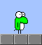
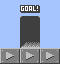
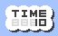
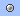
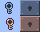
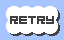

# アクションゲーム

## 概要

緑色の何かを操作して短時間でゴールを目指すゲームです。

## 流れ

ステージ選択→ゲーム開始→ゴール→ランキング登録

## 詳細

### 【緑色の何か】

- 常に動き続けます。
- 壁にぶつかると反転します。
- タップするとジャンプします。
- ジャンプ中にタップすると反転します。

### 【ゴール】

- 目指すべきところです。

### 【時間】

- 経過時間（秒）を示します。

### 【銀色の玉】

- 取ると２秒だけ時間が戻ります。

### 【鍵と壁】

- 青い鍵を取ると青い壁が消えます。
- 赤い鍵を取ると赤い壁が消えます。

### 【止まる床】

- 上に乗ると動きが止まります。
- ジャンプで抜け出せます。

### 【リトライ】

- ランキング登録後に押すとリトライできます。

## 更新履歴

### 【2019/01/06】

- 公開。

### 【2019/01/13】

- ステージ6から9を追加。
- 鍵と壁の仕掛けを追加。
- 止まる床の仕掛けを追加。
- リトライ機能を追加。

## プレイ

[ここをクリックしてください。](https://m-owada.github.io/action-test/)

- 現在ランキング登録はできません。過去のランキングは[こちら](RANK.md)でご確認ください。